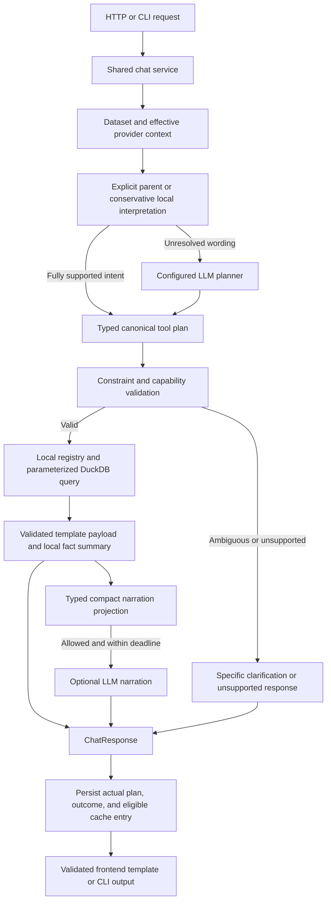

# Natural-language chat reliability: investigation and implementation plan

Date: 16 September 2026. Investigated revision: `460285a`.

Status: proposed implementation; application code has not been changed.

## 1. Outcome and scope

Make the base experience dependable: a person asks an ordinary health-data question,
the app interprets it accurately, queries local data, and displays a useful structured
answer with a short grounded explanation. If the requested analysis is unsupported,
ambiguous, unavailable, or empty, say which situation applies instead of answering
a different question.

This replaces the earlier demo-polish proposal. No Replay, presentation mode, UI
redesign, ingestion rewrite, new database, arbitrary SQL generation, or multi-agent
runtime is required. Preserve DuckDB queries, the analytics registry, provider gateway,
existing templates, and the `ChatResponse` envelope.

The target repair release supports latest workouts, workout rankings, scoped training
summaries/comparisons, and trends for the existing queryable metric catalog. Activity
filtering for summaries requires the extension below; current summaries cover all
activities. Ordinary
paraphrases should work within those capabilities. Sleep analysis, pace ranking,
cross-metric correlation, medical interpretation, and arbitrary multi-part questions
must not be presented as supported merely because an LLM can describe them.

## 2. What was investigated

Three GPT-5.6 Luna xhigh subagents investigated planning/tool dispatch, provider runtime,
and API/frontend contracts. The main agent independently reproduced key defects,
tested queries, and assembled this plan.

Evidence came from source inspection, synthetic fixtures, targeted automated tests,
and loopback-only model probes. Personal health records and conversation contents
were not used as model input. No hosted provider was called. Servers were not started,
stopped, or reconfigured. Existing untracked `audit/`, `plan.md`, and
`docs/STACKED_PR_REVIEW.md` were left alone.

### Runtime observations

- Effective persisted provider was local LiteRT, `gemma4-e2b`, at
  `http://127.0.0.1:9379/v1`. Local mode permits both local planning and narration;
  `local_only` blocks hosted egress, not loopback inference.
- `/v1/models` responded successfully. A synthetic completion succeeded directly in
  about 1.47 seconds and through the configured gateway in about 1.70 seconds.
  These short probes establish generation availability, not general planning quality.
- Lifecycle status reported `running=False` because its owned-process pidfile was
  stale, although another LiteRT process was serving the configured endpoint.
  Existing lifecycle logs showed repeated address-in-use spawn failures.
- Backend port 8000 and Vite port 5173 were not listening when probed. This is a
  snapshot of the investigation environment, not proof of what happened during the
  user's previous attempt. Browser-to-server behavior still needs a live acceptance run.
- A temporary-state probe established that persisted custom LiteRT URL/model settings
  reach the chat gateway, but lifecycle status/health still inspect environment/default
  settings. Readiness can therefore describe a different endpoint from actual chat.
- A wrong-model probe returned healthy from `/models` but a synthetic completion for
  that missing model returned HTTP 404. Current health checks inspect status only.
- Using the real local model through `ChatOrchestrator` with in-memory fixture data,
  `Find the newest running session` returned a correct workout card and grounded
  narrative in 9.76 seconds. `Plot steps by day for June 2026` fell back after 7.75
  seconds: the model supplied `metric_id="Steps"`, which the registry rejected.
  This directly reproduces a natural-language-to-tool failure with an available LLM.
  These are two observations, not a representative model benchmark.

## 3. Confirmed defects, ordered by impact

| Priority | Finding | Evidence and consequence |
| --- | --- | --- |
| P0 | Deterministic matching silently changes the question | `backend/app/llm/local_planner.py:101-151`: broad keyword branches discard requested metric, period, granularity, or count. These answers bypass the LLM entirely. |
| P0 | Narration receives no facts for four successful answer types | `backend/app/llm/provider_projection.py:17-84`: `rows`, `series`, and `metrics` are absent from the recursive allowlist. Real fixture dispatch results for rankings, trends, summaries, and comparisons all project to `facts={}`. |
| P0 | Provider readiness and lifecycle ownership disagree | `backend/app/llm/litert.py:190-235,538-553`: pidfile ownership drives start decisions, while the endpoint may already be usable. Persisted URL/model and lifecycle configuration also diverge. |
| P0 | Provider fallback configuration can mix local policy and hosted transport | `backend/app/llm/provider_gateway.py:375-426`: exception branches combine a potentially local provider flag with hosted client/model defaults. This is a source-confirmed failure-path risk; no external request was made or observed. |
| P0 | Fresh questions can be mistaken for follow-ups | `backend/app/llm/followups.py:86-89`: substring `it` matches words such as activity and fitness. With multiple prior contexts, normal questions become a clarification fallback before planning. |
| P1 | LLM-produced plans are not retained | `backend/app/llm/orchestrator.py:282-307` keeps the resolved plan internally; `backend/app/api/chat.py:264,379-388` persists only precomputed local/follow-up plans. LLM answers cannot reliably seed follow-ups. |
| P1 | CLI and API cache semantics differ | HTTP rejects fallback envelopes from cache; `backend/app/cli/chat.py:157-160,219-235` reads/writes them without that eligibility check. A provider failure can remain a cached CLI answer after recovery. |
| P1 | CLI closes a shared cached gateway | `backend/app/cli/chat.py:141,253` acquires the process-cached gateway and closes it after one call. Later in-process calls can receive that closed client; this is a source-confirmed lifecycle risk requiring a sequential-call regression test. |
| P1 | Failures collapse into generic fallback | Planning parse failure, provider unavailability, unsupported request, and tool failure share `_make_fallback_response`. The user cannot tell whether to rephrase, start a model, import data, or retry. |
| P1 | Tool schemas and validation can drift | Schemas in `llm/tools.py` are handwritten; `_validated_plan` verifies name/dict only. Typed analytics inputs exist, but adapters can ignore unknown fields before that validation sees them. Requested constraints can disappear. |
| P1 | Browser cannot explicitly identify a follow-up parent | `frontend/src/api/chat.ts:23-39` does not send `parent_turn_id`; live turns have client-generated IDs rather than the server's persisted turn ID. |
| P1 | Full answer cache lacks current planning/narration identity | `llm/cache_keys.py:10-35` uses static contract versions. Planner fixes require an intentional version bump; provider/narrator changes can otherwise appear ineffective because old prose is replayed. |
| P2 | Frontend trusts restored/API envelopes too far | `chat-view.tsx:227-249` parses stored JSON without a guard; `template-dispatch.tsx:72-85` performs shallow checks. Corrupt historical payloads can break loading/rendering. This is a source-confirmed risk, not a reproduced live crash. |

### Reproduced interpretation failures

Planner probes used a synthetic profile anchored at 30 June 2026. Fixture execution
independently confirmed several of the resulting wrong answers.

| Question | Current behavior | Required behavior |
| --- | --- | --- |
| Show running volume last year | Latest running workout | Running summary for 2025, or explicit unsupported scope until the filter is implemented |
| How many runs last week? | Latest running workout | Running session count within the previous calendar week |
| Top 10 cycling workouts by duration this year | Limit 5 | Limit 10, bounded by available results |
| Top runs by pace | Duration ranking | Explicit unsupported metric; do not substitute duration |
| Compare resting heart rate this month vs last month | Workout count/distance/duration/energy comparison | Explain metric comparison is not yet supported and offer a resting-HR trend |
| Show my resting heart rate daily this month | Weekly trend | Daily buckets |
| Show my last run in May 2025 | Most recent run across all dates | Latest run within May 2025, or an honest unsupported-range response |
| How many workouts did I do this week? | No deterministic plan | Training summary containing the session count |
| Show my last workout | No deterministic plan; tool requires activity type | Latest workout across activities after extending that query |
| Plot steps by day for June 2026 | Real local model emits `Steps`; executor rejects it and returns fallback | Normalize the declared alias to `steps` or `HKQuantityTypeIdentifierStepCount`; retain daily buckets |

Also reproduced: two prior contexts plus `Show all activity trends` or
`How is my fitness` returns “Which result should I use?” solely because of the
substring match. This says nothing about whether the requested analysis itself is
supported; it establishes that the wrong conversation branch runs.

### Narration defect details

The fixture was ingested through `ingest_v2` into in-memory DuckDB. Each of
`get_period_summary`, `get_trend`, `get_top_workouts`, and `get_comparison` returned a
valid structured payload, but `narration_projection(...)["facts"]` was `{}`.
The existing redaction test covers a flat workout payload only.

There are two related issues: all floats are rounded to integers regardless of units,
and fallback-tool text is also filtered out before an unnecessary narration call.
Fix the projection contract, not just the prompt. Adding “be accurate” cannot restore
facts the narrator never receives.

## 4. Target architecture



### 4.1 One canonical plan, two interpreters

Add `backend/app/models/chat_plan.py` for the internal plan contract. Keep the existing
small JSON tool-plan shape (`tool_name`, `arguments`) at the LLM boundary. Do not ask
the model for SQL, chart code, or an unrestricted agent workflow.

Both local recognition and LLM output produce the same typed plan. A local recognizer
returns one of `resolved`, `unresolved`, `clarification`, or `unsupported`, with a stable
reason. It must not declare success unless every explicit constraint is represented.

Resolve these slots: operation, metric, activity scope, absolute date range(s), bucket
granularity, and result limit. Prefer exact supported patterns and conservative
abstention over loose keyword guesses. In particular:

- A period phrase containing “last” is not evidence of a latest-workout request.
- “Compare” requires a compatible subject, not only a week/month word.
- Explicit dates, activity filters, quantities, and granularity cannot be discarded.
- Relative dates use the dataset's latest date; empty datasets have no implicit today.
- Defaults are allowed only for unspecified fields and should be visible in the result.
- Ambiguity such as “long run” uses an explicit documented threshold or asks for one.

Use the existing metric catalog and query registry to advertise actual capabilities.
Map friendly metric aliases to canonical supported IDs locally. Do not advertise all
dashboard capabilities as LLM tools when no corresponding chat executor exists.
The live `Steps` failure makes normalization and explicit metric enums an immediate
fix, not a future vocabulary enhancement. Normalize only declared aliases; do not use
fuzzy matching to convert an unknown health metric to a different measurement.

### 4.2 Strict tool contracts before dispatch

Define per-tool wire argument models with `extra="forbid"`, bounded values, finite
numbers, valid dates, and ordered date ranges. Generate planner-facing JSON schemas
from those models, retaining concise descriptions/examples. Translate wire dates and
names to the existing analytics input models in one place.

Preserve whitespace normalization for tool names. Reject unknown tools and unsupported
metrics. A plan containing `activity_type` on a tool that cannot filter activities must
not quietly lose that field. A bounded repair attempt may fix malformed LLM output
using schema errors and allowed fields only, within the same total request deadline.
An invalid local plan is an implementation defect; do not conceal it with LLM repair.

Minimal query extensions, implemented in `backend/app/db/queries.py` and exposed
through the registry/tools together:

1. Latest workout: optional activity type, optional inclusive start/end dates.
2. Period summary: optional activity filter; reuse the same scoped stats semantics as
   comparisons rather than creating another aggregation implementation.
3. Trend: preserve the catalog's existing metrics and aggregation semantics; honor
   explicit day/week/month. Do not add unsupported pace or sleep calculations here.

Keep current template IDs. A workout count can appear in `period_summary` with a direct
count sentence; it does not need a new template. Metric-to-metric or health-metric
period comparison is deferred and must return an honest capability response.

### 4.3 Keep the executed plan with the answer

Introduce an internal `AnswerResult` containing the `ChatResponse`, executed canonical
plan, outcome/reason, planner origin, narrator origin, and safe timing metadata.
Preserve `answer()` compatibility with a wrapper if necessary while migrating callers.
The public response must not expose raw plans or internal prompts.

The API and CLI must persist the actual executed plan for both deterministic and LLM
answers, never merely the plan guessed during preparation. Add optional server turn ID
and request ID metadata so the browser can reference a completed turn without confusing
its optimistic client ID with a persisted ID.

Extract shared preparation/cache/finalization behavior into `backend/app/chat_service.py` after
the critical fixes. Both transports continue to use `ChatOrchestrator`. Preserve worker
thread offloading, connection leases, cancellation cleanup, and request-scoped diagnostics.
Do not hold a SQLite session open while awaiting model inference.
Give gateway shutdown a single owner: application lifespan for the server, outer CLI
command lifecycle for headless use. A request must not close a shared cached gateway;
test two sequential in-process questions, including a first-call failure.

### 4.4 Grounded narration for every result

Replace the generic recursive allowlist with explicit projections keyed by validated
template type. Proposed new module: `llm/answer_facts.py`, used by `provider_projection.py`.

| Template | Minimum narration facts |
| --- | --- |
| Workout | Date/activity, duration, distance, available heart-rate/energy metrics |
| Ranked list | Ranking metric/unit, requested scope, bounded ordered rank/value rows |
| Trend | Metric/unit, date scope, granularity, valid/missing bucket counts, bounded representative points or deterministic summary |
| Period summary | Exact period, activity scope, labeled values and units |
| Comparison | Both exact periods, labels, values/deltas/units, partial-period caveat |
| Fallback | Terminal local explanation; no narrative generation |

Calculate trend summaries locally. Do not send arbitrarily long series, claim a
regression-derived trend from two endpoints, or hide truncation. Preserve missing values
as missing. Match the UI's unit-aware rounding, including one decimal place for km.
Exclude GPS geometry, raw rows, paths, device metadata, and unapproved fields at every
depth. Increment projection/cache contract versions.

Generate a useful deterministic sentence from the same facts for every supported
template. A narrator timeout, blank output, invalid projection, or disabled narration
must leave the structured answer intact. Never call the narrator when there are no
facts. Prompt constraints reduce hallucination risk but do not prove correctness;
acceptance tests must verify factual consistency on the supported corpus.

Retain the no-provider fast path for fully recognized questions. Unresolved supported
phrasing exercises the actual LLM planner. Do not force a model call just to make
recognized queries look more intelligent.

### 4.5 Effective configuration and truthful readiness

Pass the same resolved provider configuration into chat, status, health checks, and
lifecycle operations. Keep readiness separate from process ownership:

- Endpoint: unreachable, reachable, model available, generation verified/failed.
- Ownership: owned process, external/unowned process, or no known process.
- Configuration: selected provider/model and permitted planning/narration stages.

Load environment files once before resolving first-run defaults. Preserve existing
persisted user choices; a file containing hosted `LLM_*` settings must not implicitly
opt the user into hosted processing. Document precedence as persisted provider settings,
then process/environment-file defaults for unset initial settings. Show the effective
provider and settings source without exposing keys.

Centralize all construction, including repository-failure branches, through that resolver.
A local provider flag must never be paired with a hosted transport by fallback defaults.
Fail closed on inconsistent configuration. Enforce the intended loopback boundary for
the fully local mode; if externally hosted compatible endpoints are supported later,
classify their egress explicitly rather than calling them local. Test these exception
paths with a recording stub transport; do not make real external requests to test them.

Before autostart, probe the configured endpoint and verify the selected model exists.
Reuse a suitable already-running endpoint without adopting or killing its process.
Only terminate a process with the existing ownership proof. An occupied incompatible
port gets a specific actionable state rather than repeated spawn attempts.

Use cheap model-list checks for normal readiness; keep synthetic generation verification
an explicit bounded diagnostic and record when it last succeeded. HTTP 200 on `/models`
alone does not establish that inference works. Keep `/health` as backend liveness and
expose model readiness separately. Respect persisted URL/model settings, including
custom ports; an external endpoint must not be managed as an owned local process.

### 4.6 Failure states, provenance, deadlines, and cache

Add backward-compatible metadata for `outcome` and `reason_code`; proposed outcomes:
`answered`, `empty`, `clarification`, `unsupported`, and `unavailable`. Unexpected
infrastructure failures retain the existing safe HTTP problem response. Keep old
provenance values compatible while adding explicit planner origin
(`deterministic`, `local_model`, `hosted_model`) and narrator origin. A LiteRT answer is
currently labeled `remote_planned`; do not mistake that label for evidence of egress.

Distinguish provider disabled, endpoint unreachable, model missing, deadline exceeded,
invalid plan, unsupported capability, and missing data in safe user guidance. Do not
display provider stack traces, prompts, or SQL. Avoid dual contradictory messages such
as “matching data found” alongside “no workouts found.”

Apply one monotonic total request deadline across queue wait, planner attempts, optional
repair, and narration. Current per-attempt timeouts can accumulate across retries/stages.
Suggested initial total budget: 20 seconds, to be adjusted from measured local latency;
narration uses remaining budget and gives way to the deterministic summary. Configure
the client deadline slightly above the server budget and distinguish timeout from
user cancellation. Measure rather than claim a latency guarantee.

Share cache eligibility between API and CLI. Never cache provider failures, invalid
plans, or generic fallbacks as successful answers. Bump the planner/cache version with
the routing fixes so old wrong answers cannot mask the repair. Preserve historical
turns rather than silently rewriting them.

For the initial fix, include explicit planner, tool, projection, and narration contract
versions plus effective generation identity in full-envelope keys. Later, facts can be
cached separately by dataset+validated plan+query version, while prose is keyed by
fact digest+provider/model+narration version. A cache hit must retain original answer
origin separately from delivery origin. Fresh evaluation bypasses both caches.

### 4.7 Limited, reliable conversational continuity

Fix substring matching immediately. Fresh questions must not be blocked merely because
the conversation contains several earlier plans. Resolve supported explicit references
against a selected parent, or the latest eligible turn when unambiguous. Revalidate the
derived plan and preserve its original activity/date scope. For example, a scoped
training summary followed by “compare that with the prior period” must retain the scope.

Add `parentTurnId` to the frontend request helper and a small “Ask about this answer”
action once server turn IDs are returned. Resolve “daily instead” through the prior
trend's structured plan. This is bounded plan editing, not unrestricted conversation
memory. Keep raw transcript and tool payloads out of hosted planning prompts.

Decode live and restored envelopes with one runtime validator in
`frontend/src/api/decode-chat-envelope.ts`; a small explicit decoder can avoid a new
dependency. Catch malformed JSON
per turn, retain the question, and render safe recovery. Unknown template IDs continue
to use the existing fallback. Keep the latest answer expanded and preserve cancellation.

## 5. Implementation sequence and ownership

Use a `codex/` implementation branch. The following work packets can be delegated after
agreeing on the small shared plan/result/metadata contracts. Parallelism does not remove
the need for one integration owner.

| Packet | Files / responsibility | Acceptance gate | Dependencies |
| --- | --- | --- | --- |
| A: Regression corpus | New synthetic question corpus; planner/chat/projection tests | Current wrong-question examples fail for the right reason | None |
| B: Facts and narrative repair | `provider_projection.py`, proposed `answer_facts.py`, `orchestrator.py`, redaction tests | All five success templates retain useful facts; no raw data egress; fallback terminal | A |
| C: Intent and tool repair | `local_planner.py`, proposed `models/chat_plan.py`, `tools.py`, `analytics/registry.py`, `db/queries.py` | Quantity, metric, dates, activity and granularity honored or explicitly declined | A |
| D: Local provider readiness | `litert.py`, `provider_gateway.py`, `api/settings.py`, startup, settings client/types | Ready-unowned endpoint reused; same config probed and queried; no unsafe stop | A; independent of B/C |
| E: Conversation/cache parity | `api/chat.py`, `cli/chat.py`, `followups.py`, `cache_keys.py`, proposed shared service | Actual remote plan persisted; no substring false references; same cache eligibility | B/C result contract |
| F: Frontend functional handling | `api/chat.ts`, `api/conversations.ts`, `types/templates.ts`, `chat-view.tsx`, template decoder | Server parent ID sent; malformed/history/failure/loading states recover | E metadata contract |
| G: Integration and docs | `docs/SPEC.md`, `docs/ENGINEERING.md`, README, test harness | Real local LLM and browser acceptance pass; commands documented | All selected packets |

For parallel execution, reserve `orchestrator.py` and `models/chat.py` edits for the
integration owner. Other agents provide compatible isolated changes, not simultaneous
rewrites of these shared files. Run fixture probes with isolated app-state files and
never replace the personal database with a test database.

### If the original five-hour window still applies

Treat this as a constrained reliability repair, not a promise to complete every packet.

1. First 30 minutes: turn the reproduced failures into tests, verify the chosen local
   model with realistic planner prompts, and freeze the immediate supported intents.
2. Next 90 minutes, in parallel: B fixes projections/terminal fallbacks; C fixes the
   dangerous local matches and explicit slots; D fixes config/readiness mismatch.
3. Next 60 minutes: integrate, fix substring follow-ups and shared cache eligibility,
   bump cache versions, and add the smallest specific failure guidance.
4. Final 120 minutes: targeted and full checks, uncached real-model fixture runs,
   browser question-to-answer acceptance, and rehearsal on explicitly selected local
   data. Keep at least the last hour free of new features.

If time tightens, preserve correctness: decline unsupported filtered/latest-in-range
queries until their tool extensions pass tests. Defer shared-service extraction,
new parent-selection UI, generic latest-workout support, and broader vocabulary before
cutting verification or silently ignoring constraints. Full architectural consolidation
is a follow-on milestone, not a prerequisite for fixing the reproduced P0 defects.

## 6. Verification and release criteria

### Deterministic and synthetic integration suite

Use the repository ingestion entry point and synthetic XML into temporary/in-memory
DuckDB. Add richer fixture data spanning multiple days, months, activities, and metrics
where existing samples cannot distinguish correct and incorrect plans.

Assert the answer's actual scope and values, not just `template_id`:

- Existing six seed prompts still work without model calls on the recognized fast path.
- Every question in the reproduction table has the specified semantics or an explicit
  unsupported/clarification result. No success answer silently drops a constraint.
- Top-N tests use enough synthetic workouts to distinguish 5 from 10; limits are bounded.
- Month/year boundaries, partial periods, Singapore midnight, and missing data behave
  consistently; machine-clock changes do not alter dataset-relative dates.
- Projection tests cover each template's positive facts and negative privacy fields,
  null values, rounding, bounded lists, and no-data outcomes.
- Invalid JSON, unknown tools, extra fields, invalid enums, reversed dates, and NaN/Inf
  are rejected before query execution. Optional repair has a strict attempt/time bound.
- A valid tool answer survives blank/failed narration with a useful local explanation.
- Fresh activity/fitness questions in multi-turn conversations do not trigger pronoun
  disambiguation. Explicit follow-ups retain selected parent/dataset/scope.
- LLM plans are persisted, cache versions change on semantic fixes, and API/CLI both
  reject previously stored degraded cache entries.
- Readiness tests cover stale pidfile + healthy external endpoint, owned cold start,
  wrong model, custom persisted port/model, timeout, and no ownership-based unsafe stop.
- Frontend tests cover loading, success, empty, unavailable, clarification, malformed
  history, unknown template, timeout, cancel, retry, and preserved question visibility.

### Actual-model acceptance (separate from stubbed tests)

Run a frozen corpus against the real configured local model using synthetic fixtures,
fresh cache mode, and representative full planner/tool prompts. Include at least ten
supported paraphrases that do not take the deterministic fast path and five unsupported
or ambiguous requests. Record plan validity, semantic correctness, fact correctness,
template correctness, fallback reason, planner/narrator calls, and latency.

Proposed release gate: all required demo questions answer correctly; no silent metric,
date, filter, or limit substitutions; unsupported questions stay honest; all template
projections retain facts; no private egress. Measure warm/cold latency and report it.
Model stochasticity means one successful forced JSON probe is insufficient evidence.

Then run a real browser against an isolated synthetic backend: submit question, observe
rendered values/chart, ask a supported follow-up, reload history, force unavailable-model
behavior, and retry after recovery. Browser visual polish is outside this milestone.

### Required repository checks after implementation

Run affected tests first, then the relevant full backend/frontend suites and gates:

```bash
make test-backend
make lint-backend
make typecheck-backend
make test-frontend
make lint-frontend
make typecheck-frontend
make check-full
```

Avoid repeating unchanged suites unnecessarily; `make check-full` is the final combined
gate and enforces coverage. Full backend coverage must remain at least 80%, ingestion
90%, and LLM modules 70%. A skipped live-model/browser check must be reported as skipped,
not counted as passing because stubbed tests passed.

## 7. Evidence gathered in this investigation

| Check | Result |
| --- | --- |
| `uv run --directory backend pytest tests/integration/test_queries.py tests/unit/test_metric_catalog.py tests/unit/test_aggregations.py -q --no-cov` | 56 passed |
| From `backend`: `uv run pytest tests/unit/test_local_planner.py tests/integration/test_chat.py tests/unit/test_provider_redaction.py tests/unit/test_tools.py -q --no-cov` | 30 passed; reproduced semantic gaps are absent from these tests |
| `backend/.venv/bin/pytest -q --no-cov backend/tests/unit/test_litert_lifecycle.py backend/tests/unit/test_provider_gateway.py backend/tests/unit/test_llm_client.py backend/tests/integration/test_settings_api.py backend/tests/integration/test_app_startup.py` | 41 passed; runtime mismatch still reproduced |
| From `frontend`: `npm test -- --run tests/api/chat.test.ts tests/components/chat-view.test.tsx tests/components/template-dispatch.test.tsx` | 27 passed |
| Real fixture dispatch followed by narration projection | Four non-workout success templates all produced empty facts |
| Synthetic local planner and follow-up probes | Wrong metric/count/date/granularity and substring defects reproduced |
| Loopback synthetic generation, direct and configured gateway | Successful; approximately 1.47s and 1.70s respectively |
| Real local model + fixture + full orchestrator: newest running session | Correct workout card/narrative in 9.76s; currently mislabeled `remote_planned` |
| Real local model + fixture + full orchestrator: steps by day | Fallback in 7.75s because model emitted unsupported alias `Steps` |
| Wrong-model readiness probe | `/models` reported healthy; completion returned 404 for a synthetic missing model |

These are targeted diagnostic checks, not a full-suite or live-browser certification.
One subagent's plain Python backend probe failed with `ModuleNotFoundError: duckdb`;
the main agent independently reproduced the projection defect using the working
`uv run --directory backend` environment. No application tests were added during this
planning pass, and no fixes are claimed as implemented.

## 8. Completion definition

The base feature is ready when ordinary supported paraphrases reach valid plans,
locally computed facts and rendered values agree, narratives have sufficient evidence,
provider state accurately describes inference readiness, and errors are recoverable.
The demo should prove one uncached LLM-planned answer in addition to deterministic
questions. A polished fallback or a passing suite of mocked completions does not by
itself satisfy that goal.
